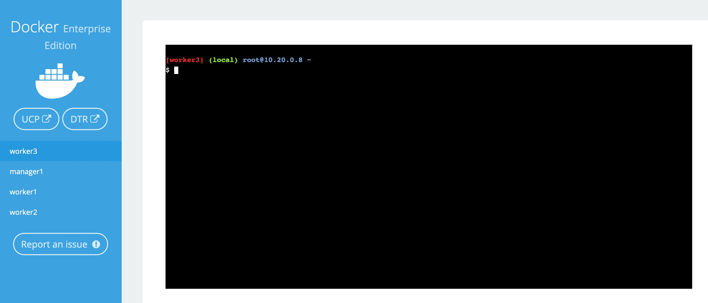
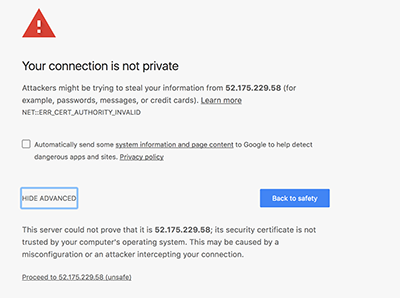
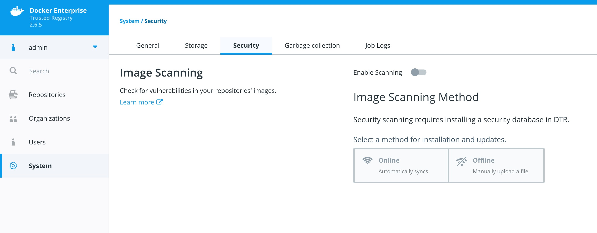
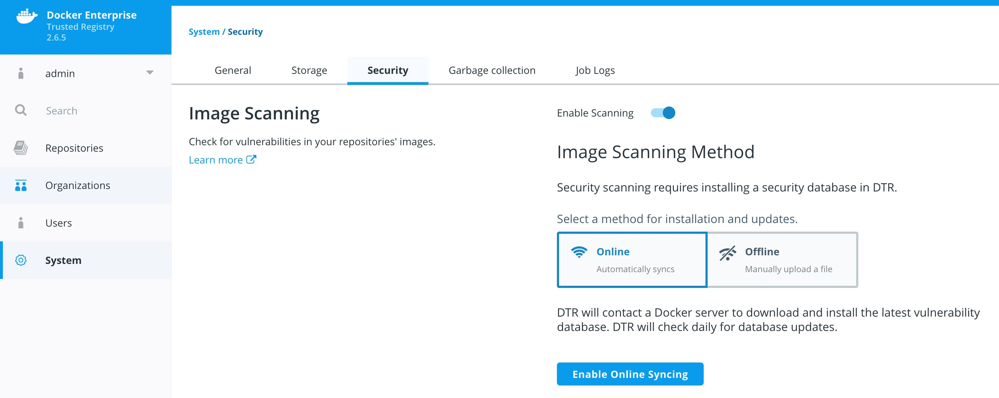

# Simple Docker Enterprise Workshop

## Who am i

* Github : [https://github.com/clemenko](https://github.com/clemenko)
* Twitter : [@clemenko](https://twitter.com/clemenko)
* Email : [clemenko@docker.com](mailto:clemenko@docker.com)

---

You will play with Docker Enterprise

> **Difficulty**: Intermediate
>
> **Time**: Approximately 90 minutes

## Document conventions

When you encounter a phrase in between `<` and `>`  you are meant to substitute in a different value.
We are going to leverage the power of [Play With Docker](http://play-with-docker.com).

## Abbreviations

The following abbreviations are used in this document:

* UCP = Universal Control Plane
* DTR = Docker Trusted Registry
* DCT = Docker Content Trust
* CVE = Common Vulnerabilities and Exposures
* PWD = Play With Docker

## Prerequisites

This lab requires an instance of Docker Enterprise. Docker Enterprise includes Docker Universal Control Plane and Docker Trusted Registry. This lab provides Docker Enterprise.

## Understanding the Play With Docker Interface



This workshop is only available to people in a pre-arranged workshop. That may happen through a [Docker Meetup](https://events.docker.com/chapters/), a conference workshop that is being led by someone who has made these arrangements, or special arrangements between Docker and your company. The workshop leader will provide you with the URL to a workshop environment that includes [Docker Enterprise](https://www.docker.com/enterprise-edition). The environment will be based on [Play with Docker](https://labs.play-with-docker.com/).

If none of these apply to you, contact your local [Docker Meetup Chapter](https://events.docker.com/chapters/) and ask if there are any scheduled workshops. In the meantime, you may be interested in the labs available through the [Play with Docker Classroom](https://training.play-with-docker.com/alacart/).

There are three main components to the Play With Docker (PWD) interface.

### 1. Console Access

Play with Docker provides access to the 3 Docker Enterprise hosts in your Cluster. These machines are:

* A Linux-based Docker Enterprise 2.1 (UCP 3.1.6 & DTR 2.6.5 & 18.09.2)  Manager node
* Three Linux-based Docker Enterprise 2.1 (18.09.2) Worker nodes

By clicking a name on the left, the console window will be connected to that node.

### 2. Access to your Universal Control Plane (UCP) and Docker Trusted Registry (DTR) servers

Additionally, the PWD screen provides you with a one-click access to the Universal Control Plane (UCP)
web-based management interface as well as the Docker Trusted Registry (DTR) web-based management interface. Clicking on either the `UCP` or `DTR` button will bring up the respective server web interface in a new tab.

### 3. Session Information

Throughout the lab you will be asked to provide either hostnames or login credentials that are unique to your environment. These are displayed for you at the bottom of the screen.

**Note:**  There are a limited number of lab connections available for the day. You can use the same session all day by simply keeping your browser connection to the PWD environment open between sessions. This will help us get as many people connected as possible, and prevent you needing to get new credentials and hostnames in every lab. However, if you do lose your connection between sessions simply go to the PWD URL again and you will be given a new session.

## Introduction

This workshop is designed to demonstrate the power of Docker Secrets, Image Promotion, Scanning Engine, and Content Trust. We will walk through creating a few secrets. Deploying a stack that uses the secret. Then we will create a Docker Trusted Registry repository where we can create a promotion policy. The promotion policy leverages the output from Image Scanning result. This is the foundation of creating a Secure Supply Chain. You can read more about  secure supply chains for our [Secure Supply Chain reference architecture](https://success.docker.com/article/secure-supply-chain).

## Task 1 - Accessing PWD

1. Navigate in your web browser to the URL the workshop organizer provided to you. **Chrome is advised!**

2. Fill out the form, and click `submit`. You will then be redirected to the PWD environment. It may take a minute or so to provision out your PWD environment.

### Task 1.1 - Set Up Environment Variables

We are going to use `worker3` for **ALL** our command line work. Click on `worker3` to activate the shell.


Now we need to setup a few variables. We need to create `DTR_URL` and `DTR_USERNAME`. But the easiest way is to clone the Workshop Repo and run script.

```bash
git clone https://github.com/clemenko/simple_workshop.git
cd simple_workshop
```

Once cloned, now we can run the `var_setup.sh` script.

```bash
source dc19_supply_chain/scripts/var_setup.sh
```

Now your PWD environment variables are setup. We will use the variables for some scripting.

### Task 1.2 - Client Bundle

For a better understanding of Kubernetes we will need to download a client bundle.

```bash
./scripts/client_bundle.sh
eval "$(<env.sh)"
```

## Task 2 - Enable Docker Image Scanning

Before we create the repositories, let's start with enabling the Docker Image Scanning engine.

1. From the main PWD screen click the `DTR` button on the left side of the screen

    > **Note**: Because this is a lab-based install of Docker Enterprise we are using the default self-signed certs. Because of this your browser may display a security warning. It is safe to click through this warning.
    >
    > In a production environment you would use certs from a trusted certificate authority and would not see this screen.
    >
    > 

2. Navigate to `System` on the left pane, then `Security`.
    

3. Select `Enable Scanning`. Leave it in `Online` mode and select `Enable`. Press the button `Enable Online Scanning`. The CVE database will start downloading. This can take a few minutes. Please be patient for it to complete.
    


## Notes

* [Prometheus](https://github.com/clemenko/prometheus/)
* [Compose all the things](https://github.com/clemenko/compose_files/blob/master/compose_all_the_things.yml)
